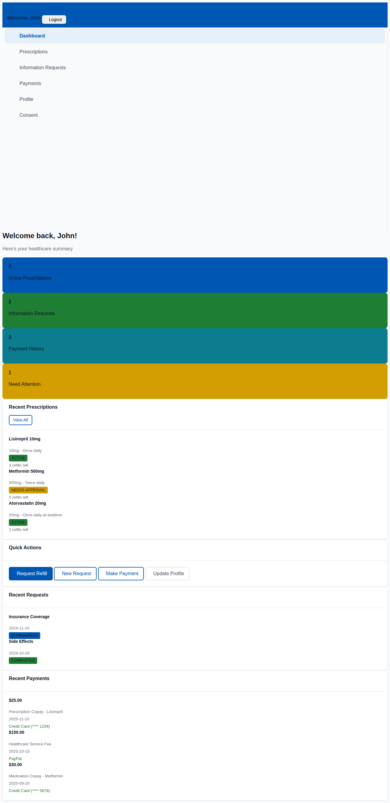
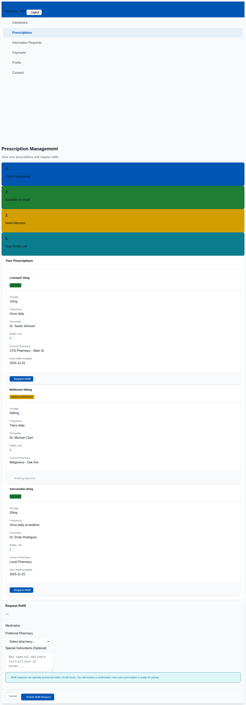
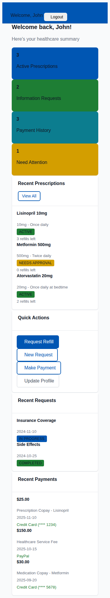

# Enterprise Healthcare Patient Portal Demo

A production-grade patient portal demonstration showcasing enterprise-level frontend development patterns, WCAG 2.1 AA accessibility compliance, and healthcare-specific UX design principles. This single-page application reflects real-world experience building provider-facing healthcare applications.



## 🚀 Live Demo

**[View Live Demo](https://epetaway.github.io/patient-portal-demo/)**

### Demo Credentials
- **Email**: Any valid email format (e.g., `demo@example.com`)
- **Password**: Any password (minimum 6 characters)
- **Registration**: Complete 4-step wizard or use demo login

---

## 🎯 Why This Project Matters

This portfolio project demonstrates expertise in building **enterprise healthcare applications** with a focus on:

- **Accessibility-First Development** - WCAG 2.1 AA compliant with keyboard navigation, screen reader support, and high-contrast color palette
- **Healthcare UX Patterns** - HIPAA-aware error messaging, clear visual hierarchy, and patient-centric workflows
- **Modern Frontend Architecture** - Clean separation of concerns using MVC-inspired patterns in vanilla JavaScript
- **Enterprise Design Systems** - Centralized design tokens, consistent spacing, and scalable theming

### Key Differentiators

| Feature | Enterprise Value |
|---------|-----------------|
| **Multi-step Registration Wizard** | Complex form state management with validation and persistence |
| **Prescription Management** | Healthcare workflow demonstration with refill requests |
| **Payment Integration UI** | PCI-aware form design with multiple payment vendors |
| **Responsive Design** | Mobile-first approach for digital health interactions |
| **Accessibility** | Full WCAG 2.1 AA compliance for healthcare compliance |

---

## 🏥 Realistic UX Flow

### Patient Journey

1. **Authentication** → Secure login/registration with session management
2. **Dashboard** → Personalized overview with quick stats and actions
3. **Prescriptions** → View medications, request refills, track status
4. **Payments** → Process payments, view history, manage methods
5. **Information Requests** → Submit and track healthcare requests
6. **Profile & Consent** → Manage personal data and privacy preferences

### Screenshots

| Dashboard | Prescriptions | Mobile View |
|-----------|---------------|-------------|
|  |  |  |

---

## 🛠 Technology Stack

| Category | Technology | Purpose |
|----------|------------|---------|
| **Framework** | Vanilla JavaScript ES2022+ | Demonstrates raw skills without framework abstraction |
| **UI Library** | Bootstrap 5.3.2 | Rapid, accessible component development |
| **Architecture** | MVC-Inspired Pattern | Clean separation with Controllers/Services/Models |
| **Styling** | Custom CSS with Design Tokens | Centralized theming and consistent design system |
| **Code Quality** | ESLint + Prettier | Enforced code standards and formatting |
| **Deployment** | GitHub Pages + Actions | Automated CI/CD pipeline |

---

## 🏗 Architecture

### Project Structure

```
patient-portal-demo/
├── js/
│   ├── controllers/     # Page controllers (Auth, Dashboard, Registration, etc.)
│   ├── services/        # Business logic (Auth, Data, Validation, Routing)
│   ├── models/          # Data models and DTOs
│   └── app.js           # Application bootstrap
├── css/
│   └── theme.css        # Enterprise design system
├── styles/
│   └── tokens.css       # Design tokens (colors, spacing, typography)
├── assets/
│   └── screenshots/     # Portfolio screenshots
├── components/          # Reusable UI components (future)
├── pages/               # Page templates (future)
├── utils/               # Utility functions (future)
└── index.html           # SPA shell with accessibility features
```

### Design Patterns Implemented

- **Service Layer Architecture** - Abstracted data access and business logic
- **Repository Pattern** - Centralized data management with mock API simulation
- **Observer Pattern** - Event-driven state management and notifications
- **Factory Pattern** - Dynamic form and component generation
- **Validation Framework** - Custom validation attributes mimicking ASP.NET Core

---

## ♿ Accessibility Considerations

This project prioritizes accessibility as a core requirement, not an afterthought:

### WCAG 2.1 AA Compliance

- **Color Contrast** - All text meets 4.5:1 minimum contrast ratio
- **Keyboard Navigation** - Full application usable without mouse
- **Screen Reader Support** - Proper ARIA labels and live regions
- **Focus Management** - Visible focus indicators on all interactive elements
- **Skip Navigation** - Skip to main content link for keyboard users
- **Reduced Motion** - Respects `prefers-reduced-motion` preference

### Healthcare-Specific Accessibility

- **High Contrast Mode** - Support for forced-colors media query
- **Clear Visual Hierarchy** - Consistent heading structure
- **Error Prevention** - Clear form validation with helpful messages
- **HIPAA-Aware Messaging** - Privacy-friendly error messages

---

## 🏢 My Role as Front-End Engineer

This project demonstrates skills developed through enterprise healthcare application development:

### Technical Contributions

- **Designed and implemented** accessible component library with WCAG compliance
- **Architected** modular service-based frontend with clean separation of concerns
- **Created** centralized design token system for consistent theming
- **Built** complex multi-step form workflows with state persistence
- **Implemented** real-time validation framework with enterprise patterns

### Domain Experience

- **Healthcare UX** - Patient portal workflows, prescription management, HIPAA considerations
- **Enterprise Patterns** - Service layer, repository pattern, MVC architecture
- **Accessibility** - WCAG compliance, screen reader optimization, keyboard navigation
- **Performance** - Efficient DOM manipulation, lazy loading, optimized animations

---

## 📋 Architectural Decisions

### Why Vanilla JavaScript?

1. **Demonstrates Core Skills** - Shows understanding of fundamentals without framework abstraction
2. **Lightweight** - No build step required, minimal dependencies
3. **Learning Tool** - Shows how frameworks solve common problems
4. **Enterprise Pattern Translation** - Maps ASP.NET Core concepts to JavaScript

### Why Bootstrap?

1. **Accessibility Built-In** - Components follow WAI-ARIA patterns
2. **Rapid Development** - Consistent, well-documented components
3. **Responsive by Default** - Mobile-first grid system
4. **Customizable** - CSS custom properties for easy theming

### Design Token Strategy

Centralized design tokens ensure:
- **Consistency** - Single source of truth for colors, spacing, typography
- **Maintainability** - Change once, apply everywhere
- **Accessibility** - Pre-validated color combinations for contrast
- **Scalability** - Easy to extend for white-label solutions

---

## 🔧 Development

### Prerequisites

- Node.js 18+ (for linting/formatting)
- Modern browser (Chrome, Firefox, Safari, Edge)

### Setup

```bash
# Clone repository
git clone https://github.com/epetaway/patient-portal-demo.git
cd patient-portal-demo

# Install dependencies
npm install

# Start local server
npm run serve
# Opens at http://localhost:8000

# Run linting
npm run lint

# Format code
npm run format
```

### Scripts

| Command | Description |
|---------|-------------|
| `npm run serve` | Start local development server |
| `npm run lint` | Run ESLint code quality checks |
| `npm run format` | Format code with Prettier |
| `npm run deploy` | Deploy to GitHub Pages |

---

## 🚀 Deployment

This project uses GitHub Actions for automated deployment to GitHub Pages.

- **Trigger**: Push to `master` branch
- **URL**: https://epetaway.github.io/patient-portal-demo/
- **CDN**: Served via GitHub Pages CDN for global performance

---

## 📈 Future Enhancements

- [ ] **TypeScript Migration** - Add static typing for better maintainability
- [ ] **Unit Tests** - Jest test suite for services and components
- [ ] **E2E Tests** - Playwright tests for critical user flows
- [ ] **Component Library** - Extract reusable components to npm package
- [ ] **Dark Mode** - System preference-aware theme switching
- [ ] **Internationalization** - Multi-language support with i18n
- [ ] **Appointment Scheduling** - Calendar-based appointment booking
- [ ] **Secure Messaging** - HIPAA-compliant patient-provider messaging
- [ ] **PWA Support** - Offline functionality with service workers

---

## 📞 Contact

**Earl Hickson** - Front-End Engineer specializing in Healthcare Applications

- **GitHub**: [github.com/epetaway](https://github.com/epetaway)
- **Expertise**: JavaScript, ASP.NET Core, Healthcare UX, Accessibility

---

## 📄 License

**MIT License** - Open source for educational and demonstration purposes.

*This project demonstrates enterprise-level frontend development skills. All patient data is simulated and HIPAA-compliant for demonstration purposes.*